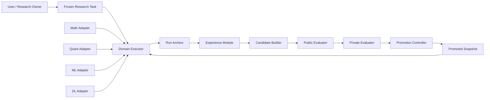

# 总体架构

## 1. 架构目标

系统需要同时支持数学、量化、机器学习和深度学习，但不能用一个领域的概念污染其他领域。架构因此采用：

```text
通用科研治理内核
+
领域 Adapter
+
领域执行器/Skill
+
独立 Evaluator 与 Promotion Controller
```

通用内核提供稳定 interface 和证据治理；Adapter 把领域语义翻译成通用对象；执行器完成研究；Evaluator 独立判断；Promotion Controller 决定候选是否能成为 Champion。

## 2. 受信任关系



约束：

- Executor 可以写自己的 run archive，但不能写 Evaluator；
- Candidate Builder 可以读公开经验和公开 cases，但不能读 private/hidden；
- Private Evaluator 只接收 immutable candidate bundle；
- Promotion Controller 不修改评测结果，只消费 hash-bound report；
- 已启动的 run 不读取“最新规则”，只读取创建时冻结的 promoted snapshot。

## 3. 通用领域模型

### 3.1 ResearchTask

冻结研究问题、对象域、时间/数据范围、资源、权限、完成标准与允许的外部影响。

### 3.2 Claim

通用 Claim 类型：

```text
engineering_claim
data_claim
mathematical_claim
empirical_claim
predictive_claim
strategy_claim
production_claim
```

Claim 必须记录 `scope`、`status`、`supporting_evidence`、`limitations` 和 `non_entailments`。

### 3.3 Evidence

Evidence 只说明它直接支持的 Claim，不通过文件存在或测试退出码自动升级证据等级。每项 Evidence 至少绑定：

- 生成工具/模型及版本；
- 输入、配置、代码与数据标识；
- 时间；
- 内容 hash；
- 适用范围；
- 证据等级；
- 已知限制。

### 3.4 Run

Run 冻结 executor、Adapter、资源、随机性、输入和版本。所有结果引用同一 run manifest。

### 3.5 FailureObservation / FailureAnalysis

- `FailureObservation` 是不可修改的当时事实；
- `FailureAnalysis` 是 append-only 的解释，可通过 `supersedes` 修订；
- 根因默认是 hypothesis，只有复现、反事实修复和独立复核后才能晋级。

### 3.6 EvaluationCase / EvaluationResult

Case 冻结输入、Claim 类型、领域、split、资源、evaluation contract 和污染状态。Result 绑定 candidate、case、runner、环境和评分器。

### 3.7 Heuristic / CandidateBundle / PromotionDecision

- Heuristic 是经证据支持、具有作用域和回滚方式的行为策略；
- CandidateBundle 是 immutable Skill/策略/配置/测试组合；
- PromotionDecision 是独立的批准或拒绝事实，不修改 candidate 或 report。

## 4. 深模块与 seam

### 4.1 Core Module

Core interface 只暴露少量高杠杆操作：

```text
validate_and_freeze_task(...)
publish_record(...)
verify_record_graph(...)
```

Schema dispatch、hash、lineage、append-only、duplicate-key、防路径逃逸和 manifest 生成隐藏在 implementation 中。

### 4.2 Domain Adapter seam

Adapter interface 初始只保留三个职责：

```text
normalize_task(domain_input) -> DomainTask
validate_claim(claim, evidence) -> ClaimAssessment
build_evaluation_contract(case) -> EvaluationContract
```

该 seam 只有在 Math 和 Quant 两个 Adapter 的 contract tests 同时通过后才视为成立。ML/DL 接入前可以修改尚未发布的 interface；发布后使用版本化扩展，不静默破坏旧 Adapter。

### 4.3 Evaluation Module

Evaluation interface：

```text
freeze_suite(...)
evaluate(candidate, suite, envelope) -> EvaluationReport
compare(champion, challenger, policy) -> ComparisonReport
```

它隐藏 runner 差异、重复运行、统计方法、oracle/evaluation contract 和报告编排。

### 4.4 Promotion Module

Promotion interface：

```text
decide(candidate, reports, policy) -> PromotionDecision
activate(decision, target) -> PromotionReceipt
rollback(receipt) -> RollbackReceipt
```

`activate` 和 `rollback` 是高风险操作，必须独立授权。首版只实现 `decide` 的离线计划和人工 Gate。

## 5. 领域 Adapter 职责

### 5.1 Math

- 量词、对象域、假设与依赖；
- proof/disproof/partial/inconclusive；
- 定理前提、coverage bridge、证明证书；
- 数值证据不得冒充全局证明；
- 复用 `math-research-solve` 只读 baseline，但不把其状态机放入 Core。

### 5.2 Quant

- schema、主键、交易日、复权、时区和单位；
- PIT 可得时间、公告/修订日、历史样本池；
- signal/execution/label 时间对齐；
- 成本、滑点、停牌、涨跌停、流动性和容量；
- 工程、数据、样本外和真实市场结论四级 Gate；
- 不把合成或短历史结果写成真实研究发现。

### 5.3 Machine Learning

- 数据 provenance、去重、分层/时间切分；
- 训练、验证、测试和 future holdout 隔离；
- 预处理/特征选择/调参泄漏；
- 基线、公平比较、校准、置信区间和重复种子；
- 分布漂移、OOD 与 subgroup robustness；
- 不用测试集选择最终模型。

### 5.4 Deep Learning

在 ML Adapter 上增加：

- 数据和 checkpoint lineage；
- 代码、容器、驱动、CUDA 与硬件 manifest；
- 训练预算和算力公平；
- 多种子方差与训练不稳定性；
- early stopping/checkpoint 选择协议；
- ablation、scale study、恢复与中断证据。

## 6. Evaluator 分层

```text
L0 Protocol Evaluation
  schema、hash、权限、状态、导出和污染检查

L1 Artifact Replay
  对冻结的输出、证明、预测、回测和报告重新评分

L2 Agent Workflow Evaluation
  以相同资源运行完整 Agent 工作流

L3 Private Hidden Evaluation
  在独立权限域对 immutable candidate 运行隐藏集

L4 Production Canary Observation
  观察获批低风险 Candidate，不自动扩大权限
```

每份报告必须注明覆盖层级；L0/L1 通过不得表述为 L2/L3/L4 通过。

## 7. 存储与隐私

- Git 只保存 schemas、公开 cases、脱敏 fixtures、代码、策略和可发布报告；
- 私有 experience、原始数据、hidden cases、checkpoint 和凭据不进入公共仓库；
- `benchmarks/private-interface/` 只保存协议和假实现，不保存 private 内容；
- 跨项目导出必须显式选择 `local_full`、`local_redacted`、`benchmark_candidate` 或 `metrics_only`；
- 绝对路径、身份信息和受限正文默认被拒绝。

## 8. 版本兼容

- Core schema 使用 `research-*/vN`；
- Adapter 使用独立兼容版本；
- Candidate manifest 同时绑定 Core、Adapter、Skill、Evaluator 和 Policy 版本；
- 已发布的事实记录不原地迁移；新版本通过 importer 或 successor 读取；
- Tag 不等于 Champion，Champion pointer 必须由 PromotionDecision 单独更新。
