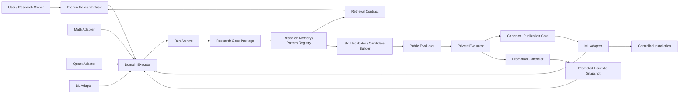

# 总体架构

## 1. 架构目标

系统需要同时支持数学、量化、机器学习和深度学习，但不能用一个领域的概念污染其他领域。架构因此采用：

```text
通用科研治理内核
+
领域 Adapter
+
领域执行器/Skill
+
Research Memory 与 Pattern Registry
+
Skill Incubator 与 Canonical Skill Library
+
独立 Evaluator 与 Promotion Controller
```

通用内核提供稳定 interface 和证据治理；Adapter 把领域语义翻译成通用对象；执行器完成研究；Research Memory 保存案例并蒸馏可复核 Pattern；Skill Incubator 只在 Pattern 达到复用门槛后生成 staged candidate；Evaluator 独立判断；Publication 与 Promotion 分别决定候选能否进入中央库、安装根和 Champion。

## 2. 受信任关系



约束：

- Executor 可以写自己的 run archive，但不能写 Evaluator；
- Research Memory 只能从已授权 Case Package 蒸馏；检索结果是 hypothesis/inspiration，不是当前 Claim 的证据；
- Pattern Registry、Skill Incubator、canonical `skills/` 和安装根是四个不同的存储/权限域；
- Candidate Builder 可以读公开或明确授权的经验和 cases，但不能读 private/hidden；
- Private Evaluator 只接收 immutable candidate bundle；
- Promotion Controller 不修改评测结果，只消费 hash-bound report；
- Canonical publication、Git 发布、Skill 安装和 Default/Preset/Champion activation 分别审批；
- 已启动的 run 不读取“最新规则”，只读取创建时冻结的 promoted snapshot。

## 3. 通用领域模型

### 3.1 ResearchTask

冻结研究问题、对象域、时间/数据范围、资源、权限、完成标准与允许的外部影响。

### 3.2 Claim

通用 Claim 类型：

```text
engineering_claim
data_claim
mathematical_claim
empirical_claim
predictive_claim
strategy_claim
production_claim
```

Claim 必须记录 `scope`、`status`、`supporting_evidence`、`limitations` 和 `non_entailments`。

### 3.3 Evidence

Evidence 只说明它直接支持的 Claim，不通过文件存在或测试退出码自动升级证据等级。每项 Evidence 至少绑定：

- 生成工具/模型及版本；
- 输入、配置、代码与数据标识；
- 时间；
- 内容 hash；
- 适用范围；
- 证据等级；
- 已知限制。

### 3.4 Run

Run 冻结 executor、Adapter、资源、随机性、输入和版本。所有结果引用同一 run manifest。

### 3.5 FailureObservation / FailureAnalysis

- `FailureObservation` 是不可修改的当时事实；
- `FailureAnalysis` 是 append-only 的解释，可通过 `supersedes` 修订；
- 根因默认是 hypothesis，只有复现、反事实修复和独立复核后才能晋级。

### 3.6 ResearchCasePackage

`ResearchCasePackage` 是一次困难科研或重大项目问题的可审计 envelope，不是最终答案摘要。它绑定：

- 冻结的 ResearchTask、Run、Claim、Evidence 和环境；
- 输入、输出和中间产物的 locator/hash manifest；
- 决策时间线、成功与失败路径、被否定假设、停止条件和未决问题；
- privacy、copyright、redaction 和 export mode；
- source project 与 successor lineage。

Case Package 默认留在项目私有域。进入中央 Pattern Registry 前必须通过 eligibility 和 redaction Gate；大型数据、模型和受限正文只保存 locator/hash，不复制进公共仓库。

### 3.7 ResearchPattern

`ResearchPattern` 是跨一个或多个 Case 蒸馏出的可复核启发，至少包含 problem signature、scope、preconditions、contraindications、成功/失败策略、证据等级、来源 Case IDs、最后验证时间、stale/successor 状态和可选 promoted Skill pointer。

Pattern 只帮助提出假设、检查遗漏和选择工具。它不能证明当前数学命题、实验结论、回测有效性或生产安全；当前 Run 必须重新验证，并把实际结果记录为 helped、neutral、harmed 或 not-applicable。

### 3.8 EvaluationCase / EvaluationResult

Case 冻结输入、Claim 类型、领域、split、资源、evaluation contract 和污染状态。Result 绑定 candidate、case、runner、环境和评分器。

### 3.9 Heuristic / CandidateBundle / SkillCandidateBundle / PromotionDecision

- Heuristic 是经证据支持、具有作用域和回滚方式的行为策略；
- CandidateBundle 是 immutable Skill/策略/配置/测试组合；
- SkillCandidateBundle 额外绑定来源 Pattern/Case、trigger/exclusion contract、payload manifest、静态/动态验收、许可/隐私审查和 retirement plan；
- PromotionDecision 是独立的批准或拒绝事实，不修改 candidate 或 report。

### 3.10 PublicationReceipt / InstallationReceipt

- `PublicationReceipt` 证明 approved candidate 已按预写 hash guard 发布为中央库 canonical Skill；
- `InstallationReceipt` 证明某个 canonical 版本已同步到指定安装根并逐文件对账；
- Git tag/Release、canonical publication、installation 和 Champion activation 不是同一事件，必须使用不同 receipt。

## 4. 深模块与 seam

### 4.1 Core Module

Core interface 只暴露少量高杠杆操作：

```text
validate_and_freeze_task(...)
publish_record(...)
verify_record_graph(...)
```

Schema dispatch、hash、lineage、append-only、duplicate-key、防路径逃逸和 manifest 生成隐藏在 implementation 中。

### 4.2 Domain Adapter seam

Adapter interface 初始只保留三个职责：

```text
normalize_task(domain_input) -> DomainTask
validate_claim(claim, evidence) -> ClaimAssessment
build_evaluation_contract(case) -> EvaluationContract
```

该 seam 只有在 Math 和 Quant 两个 Adapter 的 contract tests 同时通过后才视为成立。ML/DL 接入前可以修改尚未发布的 interface；发布后使用版本化扩展，不静默破坏旧 Adapter。

### 4.3 Research Memory Module

Research Memory 复用现有 `experience` 边界，不另建一组只转发的浅层服务。它暴露：

```text
capture_case(run, artifacts, export_policy) -> ResearchCasePackage
distill_patterns(case_set, review_contract) -> PatternProposalSet
retrieve_patterns(problem_signature, policy) -> RankedPatternSet
record_reuse_outcome(run, pattern_snapshot, outcome) -> ReuseEvent
```

它隐藏 redaction、manifest、去重、append-only lifecycle、索引和排序实现。首版只使用确定性 metadata/text 检索；只有 corpus 规模和评测证明需要第二种实现时，才增加 embedding/vector adapter，避免过早形成浅层端口。

检索 contract 必须返回 applicability、contraindications、evidence、source、last-validated 和差异说明，允许合法空结果；相似度不得成为自动执行或晋级依据。

### 4.4 Skill Incubator Module

Skill Incubator 是 Pattern 到可评测 Skill payload 的唯一入口：

```text
propose_skill(pattern_set, skill_contract) -> SkillCandidateBundle
validate_skill(candidate, suites) -> SkillCandidateReport
plan_publication(candidate, target) -> PublicationPlan
```

它隐藏 Skill 初始化、progressive-disclosure 资源布局、manifest、trigger collision、candidate archive 和 staged diff。`plan_publication` 只生成计划和预期差异；真正中央库写入、Git 发布和安装由授权执行器完成。私有 source evidence 留在外部 manifest，不进入可安装 payload。

### 4.5 Evaluation Module

Evaluation interface：

```text
freeze_suite(...)
evaluate(candidate, suite, envelope) -> EvaluationReport
compare(champion, challenger, policy) -> ComparisonReport
```

它隐藏 runner 差异、重复运行、统计方法、oracle/evaluation contract 和报告编排。

### 4.6 Publication 与 Promotion Module

Promotion interface：

```text
publish_canonical(candidate, decision, target) -> PublicationReceipt
install_canonical(publication, target) -> InstallationReceipt
decide(candidate, reports, policy) -> PromotionDecision
activate(decision, target) -> PromotionReceipt
rollback(receipt) -> RollbackReceipt
```

`publish_canonical`、`install_canonical`、`activate` 和 `rollback` 都是高风险操作，必须分别授权。首版只实现 publication/install 的离线计划、`decide` 和人工 Gate。中央库写入使用 staged mirror、预写目标 hash guard、逐文件 diff 与 receipt；安装根是中央库的派生副本，不允许多根并行手改。

## 5. 领域 Adapter 职责

### 5.1 Math

- 量词、对象域、假设与依赖；
- proof/disproof/partial/inconclusive；
- 定理前提、coverage bridge、证明证书；
- 数值证据不得冒充全局证明；
- 复用 `math-research-solve` 只读 baseline，但不把其状态机放入 Core。

### 5.2 Quant

- schema、主键、交易日、复权、时区和单位；
- PIT 可得时间、公告/修订日、历史样本池；
- signal/execution/label 时间对齐；
- 成本、滑点、停牌、涨跌停、流动性和容量；
- 工程、数据、样本外和真实市场结论四级 Gate；
- 不把合成或短历史结果写成真实研究发现。

### 5.3 Machine Learning

- 数据 provenance、去重、分层/时间切分；
- 训练、验证、测试和 future holdout 隔离；
- 预处理/特征选择/调参泄漏；
- 基线、公平比较、校准、置信区间和重复种子；
- 分布漂移、OOD 与 subgroup robustness；
- 不用测试集选择最终模型。

### 5.4 Deep Learning

在 ML Adapter 上增加：

- 数据和 checkpoint lineage；
- 代码、容器、驱动、CUDA 与硬件 manifest；
- 训练预算和算力公平；
- 多种子方差与训练不稳定性；
- early stopping/checkpoint 选择协议；
- ablation、scale study、恢复与中断证据。

## 6. Evaluator 分层

```text
L0 Protocol Evaluation
  schema、hash、权限、状态、导出和污染检查

L1 Artifact Replay
  对冻结的输出、证明、预测、回测和报告重新评分

L2 Agent Workflow Evaluation
  以相同资源运行完整 Agent 工作流

L3 Private Hidden Evaluation
  在独立权限域对 immutable candidate 运行隐藏集

L4 Production Canary Observation
  观察获批低风险 Candidate，不自动扩大权限
```

每份报告必须注明覆盖层级；L0/L1 通过不得表述为 L2/L3/L4 通过。

## 7. 存储与隐私

- Git 只保存 schemas、公开 cases、脱敏 fixtures、代码、策略和可发布报告；
- 私有 experience、原始数据、hidden cases、checkpoint 和凭据不进入公共仓库；
- `benchmarks/private-interface/` 只保存协议和假实现，不保存 private 内容；
- 跨项目导出必须显式选择 `local_full`、`local_redacted`、`benchmark_candidate` 或 `metrics_only`；
- 绝对路径、身份信息和受限正文默认被拒绝。

中央 Skill 库使用可配置 `$SKILL_LIBRARY_ROOT`，逻辑布局如下：

```text
$SKILL_LIBRARY_ROOT/
├── skills/                         # 仅 approved canonical Skill payload
├── research-patterns/              # 不可被 Skill runtime 自动发现
│   ├── math/
│   ├── quant/
│   ├── ml/
│   ├── dl/
│   └── project-engineering/
├── skill-incubator/                # candidates/evaluations/rejected/archived
└── catalogs/                       # 可重建索引，不是事实源
```

- Case Package 的事实源是项目 archive；中央库只保存经审批的脱敏导出或 locator/hash；
- Pattern Registry 是可复核知识源，`catalogs/` 只是派生索引，损坏后必须能从 canonical records 重建；
- staged Skill Candidate 不得放入自动发现的 `skills/`；只有 publication decision 通过后才能进入 canonical `skills/`；
- canonical Skill 和 installed Skill 分离；同步后逐文件 hash 对账，receiver-owned metadata 由接收方重建或由比较器规范化排除；
- Kimi 等接收方增加的 harness frontmatter 不属于可被中央 payload 覆盖删除的内容。

## 8. 版本兼容

- Core schema 使用 `research-*/vN`；
- Adapter 使用独立兼容版本；
- Candidate manifest 同时绑定 Core、Adapter、Skill、Evaluator 和 Policy 版本；
- ResearchPattern 记录 schema version、source Case hashes、last-validated 和 successor；过期 Pattern 不原地改写；
- SkillCandidate manifest 绑定 Pattern snapshot、payload、测试、trigger contract 和 receiver compatibility；
- 已发布的事实记录不原地迁移；新版本通过 importer 或 successor 读取；
- Tag 不等于 canonical publication，canonical publication 不等于安装，安装不等于 Champion；Champion pointer 必须由 PromotionDecision 单独更新。
